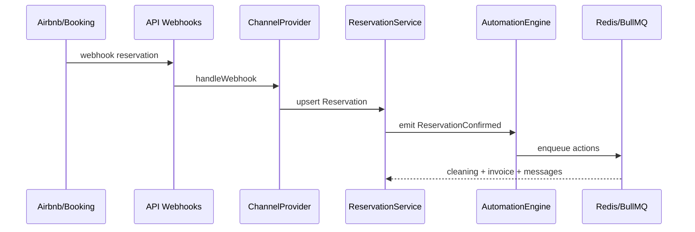

# Architecture — PMS SaaS (Location saisonnière)

## Vision

Plateforme multi-tenant de gestion de locations saisonnières (PMS + Channel Manager + CRM + Ops), conçue pour conciergeries et gestionnaires multi-biens.

Stack : **React / TypeScript / Node.js / Express / PostgreSQL / Prisma / Redis / Supabase Auth / Stripe / Docker**.

Principes : **SOLID**, **Clean Architecture**, **DDD**, modularité, scalabilité horizontale.

---

## Monorepo

```
saas/
├── apps/
│   ├── api/                 # Backend Express (Clean Architecture)
│   └── web/                 # Frontend React (Vite)
├── packages/
│   ├── domain/              # Types / value objects partagés (DDD)
│   ├── providers/           # Channel Manager (Booking, Airbnb, …)
│   └── shared/              # Utilitaires, schémas Zod partagés
├── docs/                    # Architecture, roadmap, API
└── docker-compose.yml
```

L’annuaire marketing (`/`) reste indépendant. Le SaaS vit sous `saas/`.

---

## Bounded Contexts (DDD)

| Context | Responsabilité |
|---------|----------------|
| **Identity & Access** | Users Supabase, orgs, RBAC fin |
| **Catalog** | Propriétés, médias, équipements, guides |
| **Commercial** | Réservations, tarification, disponibilités |
| **Distribution** | Channel Manager + iCal + webhooks |
| **Finance** | Paiements Stripe, factures, TVA, avoirs |
| **Operations** | Ménage, maintenance, check-in/out, inventaire |
| **CRM** | Propriétaires, voyageurs, prestataires |
| **Communication** | Inbox unifiée multi-canal |
| **Automation** | Moteur règles IF/THEN (type Zapier) |
| **Analytics** | Occupation, ADR, RevPAR, rapports |
| **Intelligence** | Couche IA (prévue, découplée) |

Chaque contexte = module API (`src/modules/<name>/`) avec :

```
domain/          # entités, ports (interfaces)
application/     # use cases / services
infrastructure/  # Prisma, Redis, Stripe, providers
http/            # controllers + routes
```

---

## Couches (Clean Architecture)

```
┌─────────────────────────────────────┐
│  UI (React) / OpenAPI clients       │
├─────────────────────────────────────┤
│  HTTP Controllers + Middleware      │
├─────────────────────────────────────┤
│  Application Services (use cases)   │
├─────────────────────────────────────┤
│  Domain (entities, ports, rules)    │
├─────────────────────────────────────┤
│  Infrastructure (Prisma, Redis, …)  │
└─────────────────────────────────────┘
```

- Les **dépendances pointent vers l’intérieur** (domain ne connaît pas Express/Prisma).
- Les **providers OTA** implémentent `ChannelProvider` (Open/Closed).
- L’**auth** est externalisée (Supabase JWT) ; l’API vérifie le token et résout `orgId` + permissions.

---

## Multi-tenant

- Toute donnée métier porte `organizationId`.
- Middleware `tenantMiddleware` + filtre Prisma systématique.
- Rôles : `SUPER_ADMIN`, `ENTERPRISE`, `MANAGER`, `RECEPTION`, `CLEANING`, `MAINTENANCE`, `OWNER`.
- Permissions granulaires via tables `Role` / `Permission` / `RolePermission`.

---

## Channel Manager

```
packages/providers/
  contracts/ChannelProvider.ts   # interface unique
  booking|airbnb|vrbo|expedia|google|abritel/
  registry/ProviderRegistry.ts
```

Chaque provider : `authentication`, `reservations`, `availability`, `pricing`, `messaging`, `calendar`, `webhooks`.

Ajout d’une plateforme = nouvelle classe + enregistrement registry (**sans modifier** le cœur).

---

## Tarification

`PricingEngine` applique une pile de règles :

- prix nuit / week-end / saison / événement  
- min / max  
- séjour min / max  
- réductions / promotions  
- extension future : **Dynamic Pricing** (plugin IA)

---

## Automatisations

`AutomationEngine` : règles `SI événement ALORS actions[]`.

Ex. : réservation confirmée → email + tâche ménage + facture + guide + notif propriétaire.

Exécution asynchrone via **BullMQ / Redis**.

---

## Données & perf

- **PostgreSQL** : source de vérité (Prisma).
- **Redis** : cache sessions/permissions, files BullMQ, rate-limit.
- Index sur `organizationId`, `propertyId`, dates, `status`, `channel`, `externalId`.
- iCal : sync planifiée + webhooks push quand disponibles.

---

## Sécurité

- HTTPS, Helmet, CORS strict.
- JWT Supabase (RS256/JWKS).
- Secrets OTA chiffrés au repos.
- AuditLog sur actions sensibles.
- Isolation tenant obligatoire (tests d’intégration).

---

## Observabilité (phase 2+)

- Structured logs (Pino)
- Metrics (occupation sync, latence providers)
- Tracing webhooks OTA

---

## Diagramme de flux réservation


